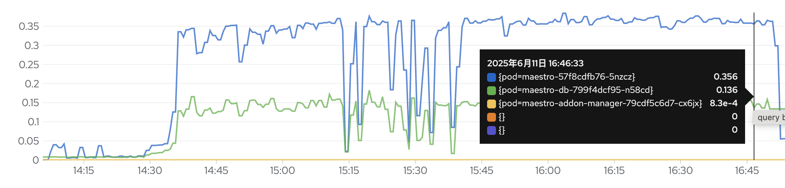
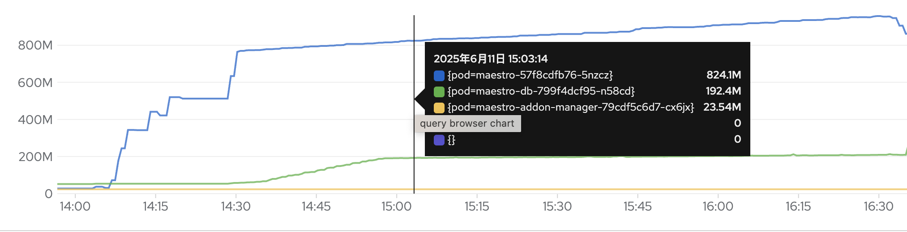
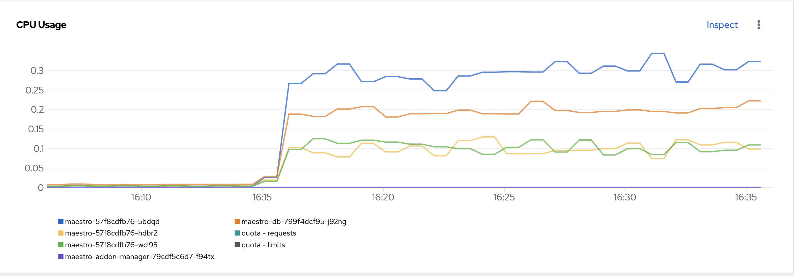
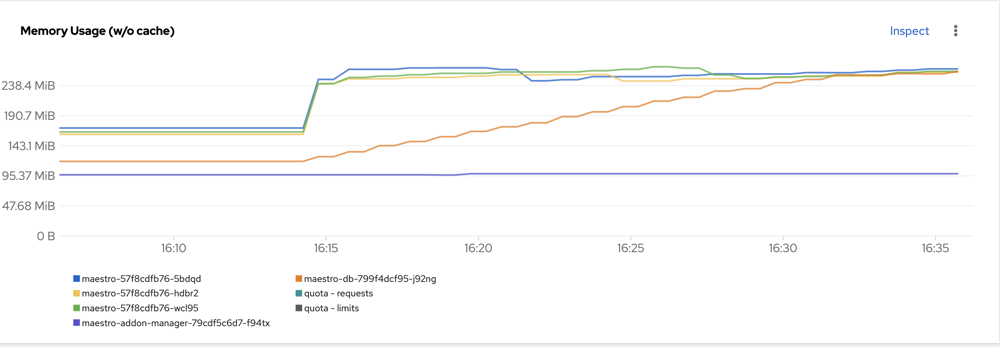

## Workloads

- Total clusters are 3000 clusters.
- Each cluster has 50 manifestworks.
- Each manifestwork contains one [guestbook application](pkg/workloads/manifests/guestbook/) witch has 7 kube resources, and we simulated the actual situation to add the status to manifestwork, one manifestwork size is 11.7K (including spec 4.5K and status 7.2K)
- Total manifestworks are 150,000, total size is 1.6G.
- Total cloudevents are 300,000 (including spec and status cloudevents)

## Test Steps

1. Create 3000 clusters (consumers) in the maestro

```sh
hack/prepare.grpc.sh
```

2. Start 3000 agents to connect maestro gRPC broker (one agent represents a cluster)

```sh
export WORK_DIR="$HOME/go/src/github.com/stolostron/maestro-addon/_output/performance/acm/grpc"

go run pkg/spoke/main.go --broker=grpc --work-dir=$WORK_DIR --cluster-begin-index=1 > agent-500.log 2>agent-500.err.log &

go run pkg/spoke/main.go --broker=grpc --work-dir=$WORK_DIR --cluster-begin-index=501 > agent-1000.log 2>agent-1000.err.log &

go run pkg/spoke/main.go --broker=grpc --work-dir=$WORK_DIR --cluster-begin-index=1001 > agent-1500.log 2>agent-1500.err.log &

go run pkg/spoke/main.go --broker=grpc --work-dir=$WORK_DIR --cluster-begin-index=1501 > agent-2000.log 2>agent-2000.err.log &

go run pkg/spoke/main.go --broker=grpc --work-dir=$WORK_DIR --cluster-begin-index=2001 > agent-2500.log 2>agent-2500.err.log &

go run pkg/spoke/main.go --broker=grpc --work-dir=$WORK_DIR --cluster-begin-index=2501 > agent-3000.log 2>agent-3000.err.log &
```

3. Create 150,000 manifestworks at a rate of 20 manifestworks per second.

```sh
export WORK_DIR="$HOME/go/src/github.com/stolostron/maestro-addon/_output/performance/acm/grpc"

go run pkg/hub/maestro/works/main.go --cluster-begin-index=1 > agent-works-500.log 2>agent-works-500.err.log &

go run pkg/hub/maestro/works/main.go --cluster-begin-index=501 > agent-works-1000.log 2>agent-works-1000.err.log &

go run pkg/hub/maestro/works/main.go --cluster-begin-index=1001 > agent-works-1500.log 2>agent-works-1500.err.log &

go run pkg/hub/maestro/works/main.go --cluster-begin-index=1501 > agent-works-2000.log 2>agent-works-2000.err.log &

go run pkg/hub/maestro/works/main.go --cluster-begin-index=2001 > agent-works-2500.log 2>agent-works-2500.err.log &

go run pkg/hub/maestro/works/main.go --cluster-begin-index=2501 > agent-works-3000.log 2>agent-works-3000.err.log &
```

## Resource consumptions

### One Maestro Instance





#### Summary

1. The CPU usage is relatively stable
2. The memory usage grows linearly

### Three Maestro Instances

### One Maestro Instance





#### Summary

1. Workloads can be evenly distributed across all instances.
2. Each instance consumes the same resources.

